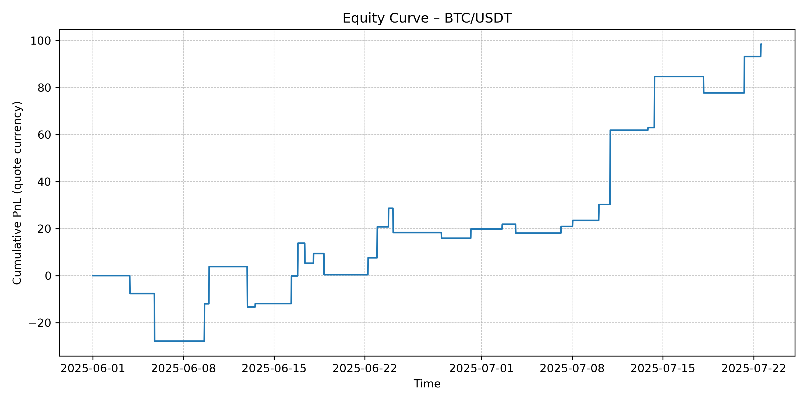
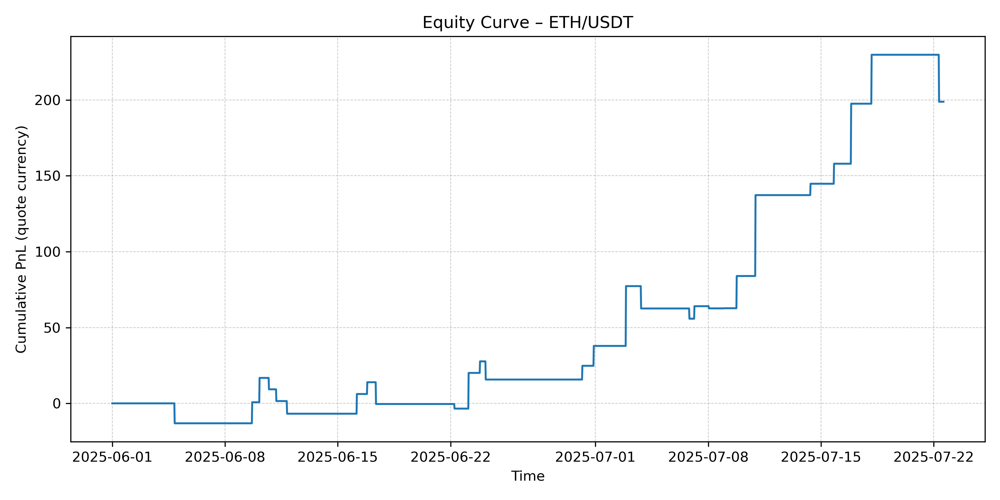
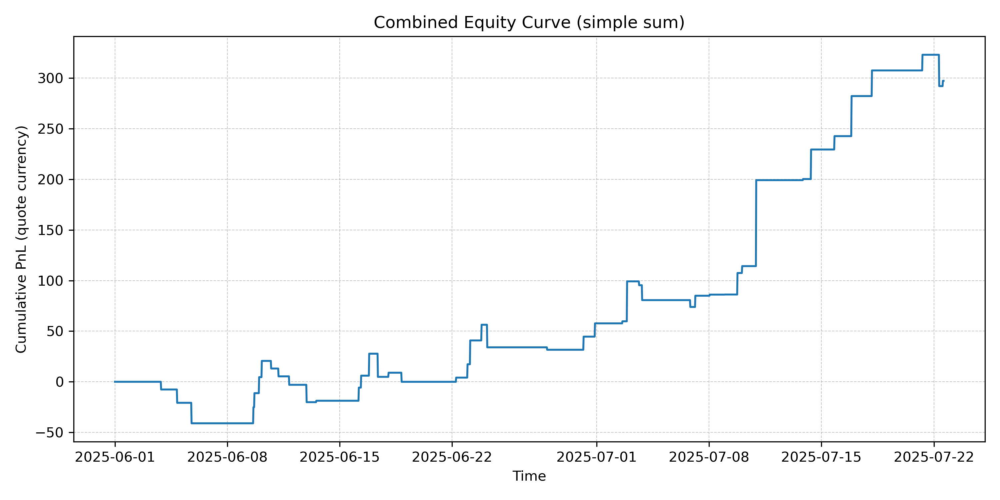

# Crypto Price Anomaly

*Quant-research sandbox that tests whether sudden positive return shocks in BTC and ETH keep running for a few more bars.*

---

## Elevator pitch
Crypto moves fast, but its biggest jumps are rarely random.  
This repo measures the size of each 30-minute return relative to recent volatility and rides the outsized ones.  
The result is a transparent, lightweight strategy you can audit, extend or tear down in minutes.

---

## Quick-start
```bash
pip install -r requirements.txt          # minimal env
python run_mvp.py --show-plots     # one-liner back-test
open outputs/equity_combined.pdf # see equity curve
````

---

## Results






---

## How it works

1. **Data** – pull clean OHLCV bars from Binance through `ccxt` (no keys needed).
2. **Features** – log-returns, 96-bar rolling mean and standard deviation.
3. **Signal** – flag bars whose Z-score ≥ 2.5, long-only, one position at a time.
4. **Back-test** – enter next open, hold 12 bars (≈ 6 h), include 5 bp per side.
5. **Plots** – cumulative PnL, drawdown, Sharpe and hit-rate, saved to `outputs/figures/`.

---

## Purpose

This project bridges my Physics MSci, Higgs-EFT thesis and KAUST acceleration work by applying the same statistical toolkit to markets.
It sharpens my understanding of finance and systematic research while demonstrating the clean engineering habits a quant seat demands.

---

## Repo layout

```
crypto_price_anomaly/
├─ src/                # data, features, back-test
├─ notebooks/          # exploratory analysis
├─ outputs/
│  └─ figures/         # equity PNGs
├─ data_raw/           # cached exchange pulls
└─ params.yaml         # all knobs in one file
```

---

## To-do / ideas

There is further work that can be done here, making live trades, etc. These are all future extentions of the project should I have time.
