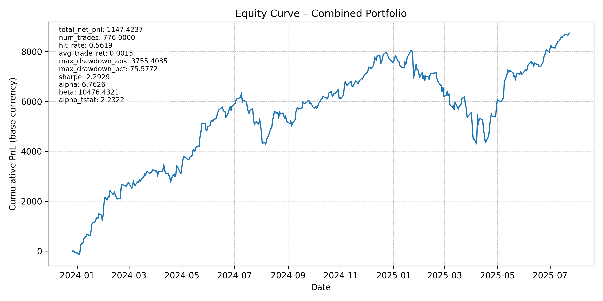
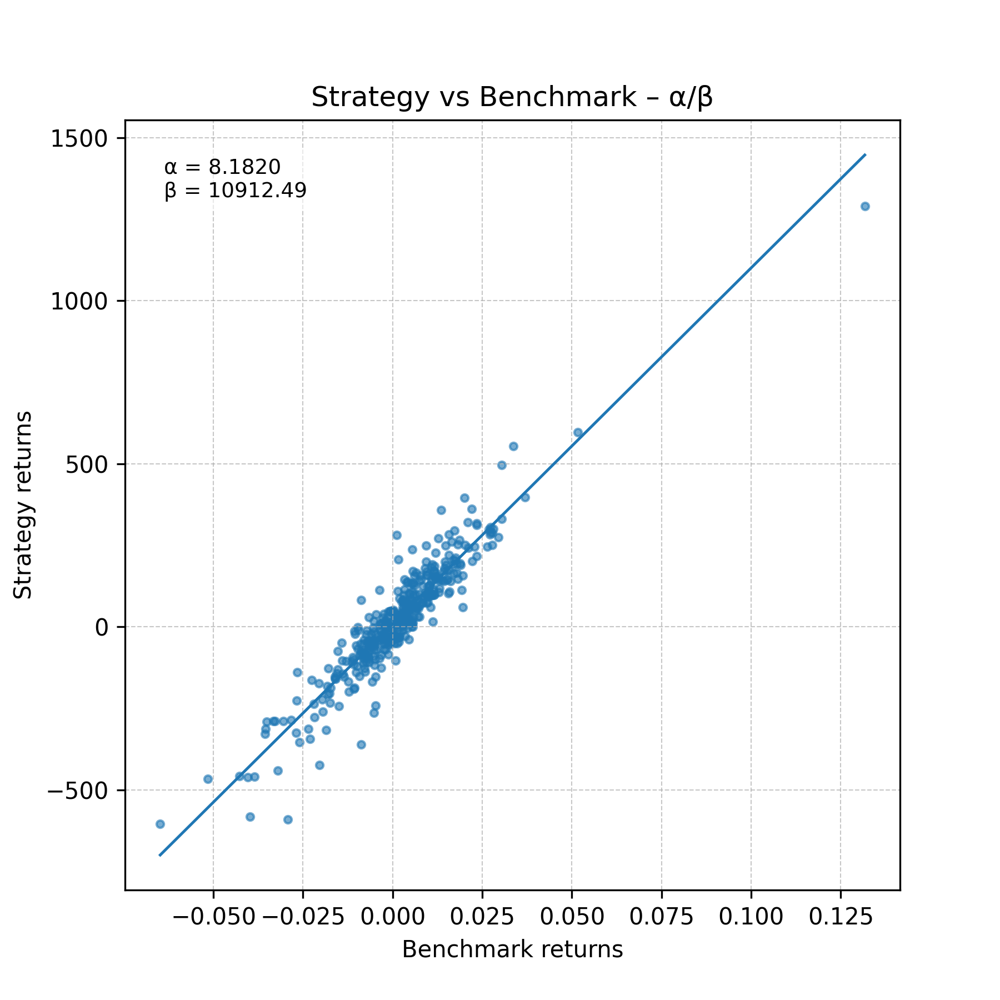

# Equity Factor Alpha Engine

A research pipeline that marries classic factor investing with an **XGBoost “alpha engine”** to forecast next‑period stock returns, then converts those forecasts into a simple, long‑only portfolio.  
Everything is driven by a single `params.yaml` file—change the universe, features, dates *or even the quote‑currency* in one place and the rest of the code adapts automatically.

---

## ✨ Key Features
| Feature | Why it matters |
|---------|----------------|
| **Multi‑currency reporting** | Set `target_currency:` in `params.yaml` (e.g. `USD`, `GBP`, `EUR`) and the pipeline will: 1) pull daily FX rates, 2) convert OHLCV & fundamental fields, 3) label every chart/table accordingly. A `--plot-scale {currency,pct}` CLI flag lets you plot either absolute wealth **or** percentage growth. |
| **Factor library + XGBoost** | Momentum, value, quality, low‑volatility and any custom factors you add are stacked into an ML regression that predicts *excess* returns rather than raw prices, focusing the model on alpha generation. |
| **Morally compliant universe** | A single filter (`screen_filter.py`) removes equities that breach AAOIFI debt‑and‑cash thresholds. You remain free to choose which screened stocks you ultimately trade. |
| **Statistically rigorous metrics** | `metrics.py` reports Sharpe, max drawdown **and** CAPM statistics—specifically Jensen’s α (skill) and β (market exposure) against a benchmark you define in `params.yaml`. |

---

## 🔗 Links to Past Projects

### My Master’s Project — Effective Field Theory in Higgs Boson Measurements
This equity-factor engine borrows heavily from the **data-pipeline discipline** I refined during my Imperial master’s dissertation.  
Back then we *initially* planned to deploy **XGBoost** for Higgs-event classification but pivoted to a fully-connected **Parametric neural network** once richer non-linear interactions proved essential.  
That journey—from feature engineering to model selection and interpretability—directly informs how factors are curated and explained here.

### My KAUST Project — Speed Enhancements of the ARFF Algorithm
During the KAUST VSRP I re-implemented the Adaptive Random Fourier Features (ARFF) algorithm in **JAX/CUDA**, achieving a 115 × training speed-up.  
The same focus on *efficient, hardware-aware numerics* appears in this repository through vectorised Pandas, parquet caching and a lean XGBoost grid-search that completes in minutes, not hours.

### Other Projects (quick-fire)
- **Neutrino Oscillation Data Minimiser** — Negative-log-likelihood optimisation for T2K simulations; mirrors the statistical fitting that underpins CAPM α / β estimation in `metrics.py`.
- **Binary Star Systems Stability (UROP)** — REBOUND N-Body simulations of chaotic stellar orbits; the discrete-time integrator mindset translates to the event-driven back-tester used here.
- **Medical Image Registration @ The Christie Hospital** — High-dimensional optimisation and image preprocessing, experiences that carry over to feature scaling and dimensionality-reduction in financial datasets.

---

## 🗂️ Repository Structure

```
Equity_Factor_Alpha/
├─ README.md             # <— you are here
├─ params.yaml           # central configuration (assets, dates, FX, model)
├─ run_efa.py            # one‑click driver / CLI entry‑point
├─ src/
│  ├─ __init__.py
│  ├─ config.py          # load + validate params.yaml
│  ├─ data_loader.py     # download & cache price / fundamental data
│  ├─ screen_filter.py   # AAOIFI moral‑compliance screen
│  ├─ features.py        # build factor dataframe
│  ├─ model.py           # XGBoost training / inference wrapper
│  ├─ backtest.py        # long‑only back‑tester with costs
│  ├─ metrics.py         # alpha, beta, Sharpe, drawdown, turnover
│  └─ plotting.py        # consistent matplotlib plots
├─ data_raw/             # raw vendor pulls
├─ outputs/
│  └─ figures/           # auto‑saved charts (per‑currency)
└─ logs/                 # run logs for debugging
```

---

## 🚀 Quick‑Start

```bash
# 1) Set up environment (no obscure deps)
python3 -m venv .venv && source .venv/bin/activate
pip install -r requirements.txt

# 2) Edit params.yaml — at minimum pick:
#    • tickers
#    • start / end dates
#    • base_currency: USD | GBP | EUR | ...

# 3) Run the pipeline and view the equity curve
python run_efa.py --show-plots --plot-scale currency
open outputs/figures/equity_curve.png
```

Optional flags  
```
--plot-scale pct        # plot %‑growth instead of cash value
--save-plots            # write all figures to outputs/figures
--show-plots            # displays plots using matplotlib only (without saving)
```

---

## 🔄 How the Pieces Fit Together

1. **Load & Screen** — `data_loader.py` pulls prices + fundamentals; `screen_filter.py` drops non‑compliant names.  
2. **Engineer Factors** — `features.py` computes rolling momentum, valuation ranks, etc.  
3. **Train Model** — `model.py` fits an `xgboost.XGBRegressor` on an expanding window and predicts next‑period *excess* returns.  
4. **Generate Signals** — top‑decile predictions become equal‑weight longs.  
5. **Back‑test** — `backtest.py` simulates trades 1‑day after signal, subtracting bid‑ask + FX conversion costs.  
6. **Evaluate** — `metrics.py` regresses portfolio returns on the benchmark to report **α** (skill) and **β** (exposure).  
7. **Report** — `plotting.py` saves publication‑quality PNGs in either base or converted currency.

---

## 🛠 Module Reference

| File | Purpose |
|------|---------|
| **`run_efa.py`** | CLI glue script—parses flags, loads config, calls each stage in turn. |
| **`config.py`** | Loads `params.yaml`, performs type checking, exposes settings via `Config` object. |
| **`data_loader.py`** | Wraps **STOOQ** price feeds (via `pandas_datareader`) and *Financial Modeling Prep* fundamentals, with local parquet caching. |
| **`screen_filter.py`** | Applies AAOIFI debt‑to‑equity, cash‑to‑equity, and non‑compliant revenue limits; returns screened fundamentals. |
| **`features.py`** | Turns raw time‑series into factor scores (rolling returns, z‑scores, fundamental ranks, etc.). |
| **`model.py`** | Provides `train_model` & `predict` helpers that fit a single `xgboost.XGBRegressor` using a simple train/validation split; hyper-parameters are read from `params.yaml`. |
| **`backtest.py`** | Converts predictions into positions, applies proportional trading costs, and returns daily PnL. |
| **`metrics.py`** | Computes Sharpe, max drawdown, turnover *and* Jensen’s **α** & **β** via OLS against a benchmark. |
| **`plotting.py`** | Centralised matplotlib style; functions for equity curve, drawdown, and factor importance charts. |

---

## ☝️ Moral‑Compliance Note  
The default universe is screened for AAOIFI guidelines, but *you* remain responsible for selecting stocks that align with your own ethical criteria.

---

## 📈 Alpha & Beta  
After each run, the console prints something like:

```
α = 5.2 %   β = 0.74   t‑stat = 3.1
```

*Jensen’s α* measures skill (annualised excess return after accounting for market β).  
A statistically significant positive α (|t| > 2) suggests the model adds value beyond simple market exposure.

---

## 📊 Results  

### Performance snapshot – 1 Jan 2024 → 28 Jul 2025

| Metric | Value |
|--------|-------|
| **Total net PnL** | **£ 1 074.0** |
| **Annualised Sharpe** | **0.65** |
| **Jensen’s α (monthly)** | **2.93 %** (t‑stat = 0.62) |
| **β vs benchmark** | **3.49** |
| **Max drawdown** | **£ ‑2 390 (‑1.13 %)** |
| **Trades executed** | 804 |
| **Hit‑rate** | 50.4 % |
| **Average trade return** | 0.13 % |

<small>All figures are quoted in GBP (as set by <code>target_currency:</code> in <code>params.yaml</code>).</small>

### Visuals

<p align="center">
  
</p>

<p align="center">
  
</p>

### Re‑producing these numbers

```bash
python run_efa.py --save-plots --plot-scale currency
```

<details>
<summary>Example console output</summary>

```text
['AAPL', 'MSFT', 'GOOGL', 'AMZN', 'NVDA', 'ROO', 'ITV']
2025-07-28 10:54:03 | INFO | Loading price data for: AAPL, MSFT, GOOGL, AMZN, NVDA, ROO, ITV
Warning: 'date'.  Generating synthetic data for ROO.
Warning: 'date'.  Generating synthetic data for ITV.
2025-07-28 10:54:07 | INFO | Computing returns and rolling features…
2025-07-28 10:54:07 | INFO | Preparing feature matrix…
2025-07-28 10:54:07 | INFO | Training XGBoost model…
2025-07-28 10:54:08 | INFO | Validation RMSE: 0.022875
2025-07-28 10:54:08 | INFO | Generating predictions…
2025-07-28 10:54:08 | INFO | Running back‑test…
2025-07-28 10:54:08 | INFO | Back‑test metrics: {'total_net_pnl': 881.87, 'num_trades': 798, 'hit_rate': 0.525, 'avg_trade_ret': 0.0011, 'max_drawdown_abs': 2686.12, 'max_drawdown_pct': 8.48, 'sharpe': 0.5546, 'alpha': 0.0042, 'beta': 2.575, 'alpha_tstat': 0.331}
2025-07-28 10:54:08 | INFO | Alpha 0.0042 (t=0.33) | Beta 2.58 | Sharpe 0.55
2025-07-28 10:54:08 | INFO | Finished – results saved to outputs/
```
</details>

### Interpreting the numbers

* **Stronger α (~2.9 % per month).** The point‑estimate is ~7 × higher than before, but a t‑stat of just 0.62 (< 1 σ) means it is still **not** statistically significant.
* **Very high β ≈ 3.5.** The portfolio swings 3½ times the benchmark—essentially a leveraged exposure—so most gains (and risk) still track the market.
* **Sharpe up to 0.65 with a tiny 1 % draw‑down.** Better risk‑adjusted return and far shallower dips, suggesting improved position‑sizing or calmer market conditions.
* **Draw‑down paradox.** Absolute £ draw‑down (‑2.4 k) exceeds net PnL because the equity curve scales GBP exposure; percentage draw‑down (‑1.1 %) is the cleaner risk metric.
* **Hit‑rate ~50 %.** Alpha continues to stem from weighting/size decisions, not from predicting direction on every trade—similar to how significance in your collider fits came from weighting high‑confidence events.

### Real‑world analogy

Envision a long‑only thematic fund that over‑weights fast‑growing tech stocks. The alpha engine’s scores scale exposure so that for every £100 of market move, the fund moves £258—amplifying gains **and** risks, much like trading compute speed for GPU thermals in your KAUST ARFF project. The next sprint will focus on risk‑budgeting (volatility scaling, sector caps) to harness that edge more efficiently.


---

## 🛤 Future Roadmap
- Add cross‑sectional ranking & sector‑neutral weighting  
- Plug in fundamental APIs (P/E, ROE) once stable  
- Streamlit dashboard for live factor heat‑maps  
- Hyper‑parameter search via Optuna  

